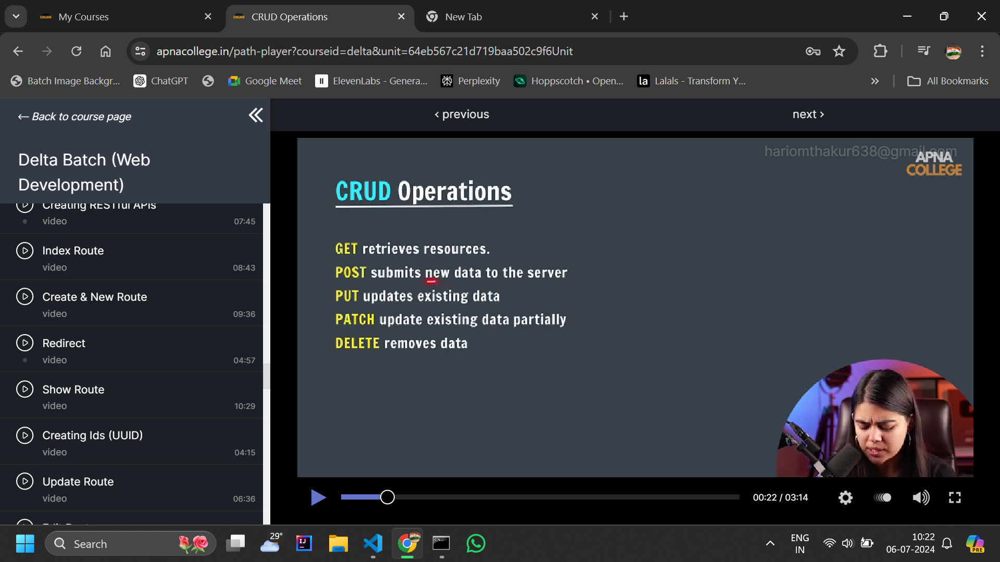

# Backend_node.js_Express_Ejs
My backend journey..........
# let's start again 🔥🔥🔥🔥

Learnings from day 1 : 

executable path for node.js
# 'C:\\Program Files\\nodejs\\node.exe',

file path of our files in the directory
 #  'D:\\Backend_node.js_Express_Ejs\\script.js',

 <b>require()</b>
 <b>Module.exports()</b>

 # NPM - node package manager
 library of packages
 command line tool
 FIGLET
 node modules - contains a package of all the dependencies of our project.
 package-lock.json - contains the exact version of all the dependencies.
 <u>package.json</u> 

 # The <u>package.json</u> file contains descriptive and functional <u>metadata</u> about a project, such as a name, version and dependencies
 command - <u>npm init </u> command is used to initialize our own package
 npm i -g "package name " -  command is used to install a package globally
 npm link "package name " - command is used to link the current directory with the global directory to share the info inside packages from one place to another place.

 # Important note - If we are using import and export features in our project then we have to add a key:value pair named as [type:"module"] in the <u>SAME</u> directory.

Learnings from day : 2

 # EXPRESS.JS
 A node.js  web application framework that helps us to make web applications.
 It is used in server side programmming.

 Main features:
 1. Listen for the incoming requests.
 2. Parse (Node.js)
 3. Match response with routes. example - https:\\hariom.com\info
 4. Sending Suitable Response.

 

* defining a port 
const port = 8080

/* ports are the logical endpoints of a network connection that is used to exchange information between a web server and a web client.*\

* requiring express

const express = require("express");

* listening to requests using routes ('/')

app.get('/hello',(req,res)=>{

    res.send("hello world");
})

* Listening to the server using the port defined.

app.listen(port,()=>{

    console.log("server is running on the port",port);
})

* Sendig responses

 app.use((req,res)=>{
    console.log("response received");
})

# Nodemon - "Automatically restarts the server and refreshes the edited code."

installation command - npm i nodemon

Syntax : nodemon file.js

# Path Parameters

Path parameters are the variables that acts as a path varible used to reach a particular path. 

syntax 

app.get('/:username/:age',(req,res)=>{

    let {username,age} = req.params;

    //req.params means the parameters that are passed in the path and it is returned as an object.

    let userPage = (`this is a page for ${username} and age : ${age}`);
    res.send(userPage);
    console.log(userPage);

})

# Query Strings

Query strings are the additional information passed in the path which is stored in the "req" object of app.get() .

Syntax 

app.get('/search',(req,res)=>{

    let  {search} = req.query;
    console.log(search);
    res.send(req.query);
})

# EJS(EMBEDDED JAVASCRIPT TEMPLATES)

EJS is a simple templating language that let's you generate HTML markup with plane Javascript.
Note - Express already requires ejs so there is no need to require the ejs again.
View package is used to show or render the templates.
Inorder to render the templates, express by default looks for a " views " folder in ejs directory.All the templates will be present there in the views folder.
If we want to render ejs file from the root directory which is the parent directory of our ejs folder which contains views folder then we have to write 

const path = require("path");

# Important EJS tags

Tags

<% 'Scriptlet' tag, for control-flow, no output
<%_ ‘Whitespace Slurping’ Scriptlet tag, strips all whitespace before it
<%= Outputs the value into the template (HTML escaped)
<%- Outputs the unescaped value into the template
<%# Comment tag, no execution, no output
<%% Outputs a literal '<%'
%> Plain ending tag
-%> Trim-mode ('newline slurp') tag, trims following newline
_%> ‘Whitespace Slurping’ ending tag, removes all whitespace after it

# Serving static files

If we want to add extra css and js in our code then we can create a public folder where we can store our files and use the public folder using the given syntax :

app.use(express.static(path.join(__dirname,"/public")))

# Includes

(SubTemplate)

Includes are relative to the template with the include call. (This requires the 'filename' option.) For example if you have "./views/users.ejs" and "./views/user/show.ejs" you would use <%- include('user/show'); %>.

You'll likely want to use the raw output tag (<%-) with your include to avoid double-escaping the HTML output.

<ul>
  <% users.forEach(function(user){ %>
    <%- include('user/show', {user: user}); %>
  <% }); %>
</ul>

#Learnings of the day 3

# GET AND POST REQUEST

*GET

=> used to get some responses
=>data sent in query strings (limited,string data & visible in URL)

*POST

=> Used to POST something (for create/Write/Update)
=> Data sent via request body (any type of data)

#FORM METHODS
=> get
=> post

# Handling Post requests

~ set up post request route to get some responses 
~ parse post request data

Syntax

//if express is receiving an urlencoded data then it will automatically understand the format of that data by writing the below line

app.use(express.urlencoded({extended:true}));
app.use(express.json());

# Object oriented programming in javascript

To structure your code

<li>prototypes</li>
<li>new operator</li>
<li>constructors</li>
<li>classes</li>
<li>keywords(extends,super)</li>

# Object Prototypes

Prototypes are the mechanism by which Javascript objects inherit features from one another. It is like a single template object that all object inherit methods and properties from without having their own copy. 

arr._proto_(reference)
Array.prototype(actual object)
String.prototype
[JS OOPS 11 (Qs).pdf](https://github.com/user-attachments/files/16110419/JS.OOPS.11.Qs.pdf)

OOPS IN JAVASCRIPT

# REST (Representational state transfer) (important topic)

REST  is an architectural style that defines a set of constraints to be used for creating web services.
CRUD OPERATIONS

CREATING RESTFUL API'S
EXAMPLE - QUORA POST

res.redirect(url)
=> redirects from a currect page,form etc to the entered path in GET response.

### UUID package ###
There is  package in express which is used to generate universally unique id's when we are implementing functionalities like adding accounts, payment receipts, course id, meetings id and etc. 

# app.patch() - method is used to update data in a path.

app.patch('/posts/:id',(req,res)=>{

}))

app.patch() method uses two parameters like a key:value pair in which in the request parameter where we have to specify the key data which is present in our code and then we can update the content inside that particular parameter but that parameter entered should match the parameter value in our dataset.
